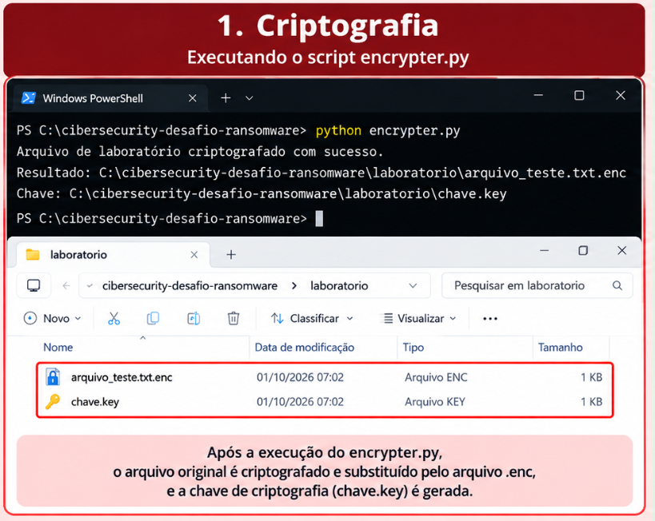
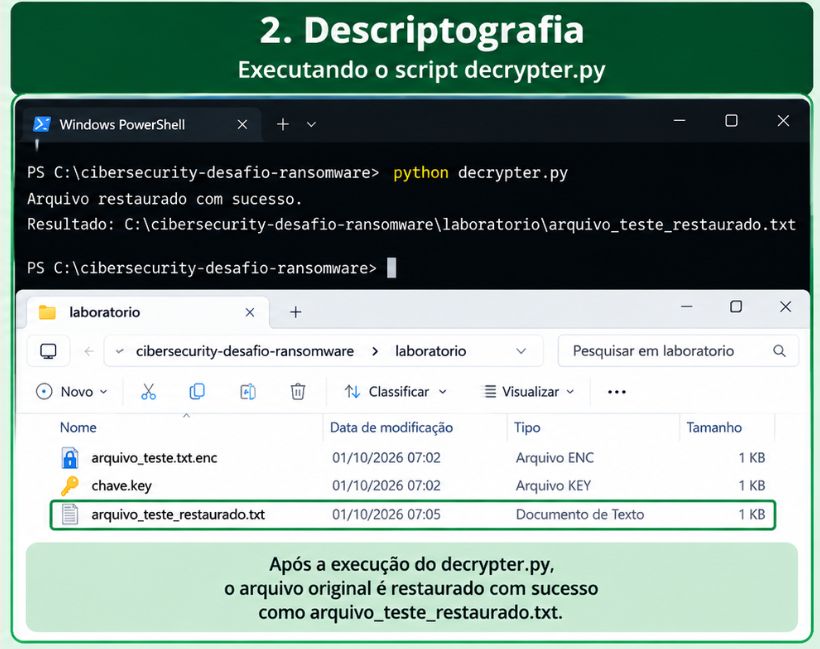

# Desafio de Projeto - Simulação Educacional de Ransomware

## Descrição

Projeto desenvolvido como parte da formação em Cibersegurança da Digital Innovation One (DIO).

O objetivo deste projeto é demonstrar, em um ambiente controlado e exclusivamente educacional, conceitos relacionados ao funcionamento de um ransomware utilizando Python.

A implementação foi adaptada para fins de estudo e utiliza somente arquivos criados especificamente para o laboratório. Nenhum arquivo pessoal ou diretório do sistema é modificado.

---

## Objetivos

- Compreender o conceito de ransomware;
- Entender o processo de criptografia e descriptografia;
- Praticar programação em Python;
- Compreender a importância da proteção de arquivos contra ataques;
- Documentar o projeto utilizando Git e GitHub.

---

## Tecnologias utilizadas

- Python 3
- Biblioteca Cryptography
- Fernet
- Git
- GitHub

---

## Estrutura do projeto

```text
cibersecurity-desafio-ransomware/
│
├── README.md
├── encrypter.py
├── decrypter.py
│
├── laboratorio/
│   └── arquivo_teste.txt
│
└── images/
    ├── README.md
    ├── 01-criptografia.png
    └── 02-descriptografia.png
```

## Funcionamento

O projeto utiliza uma pasta chamada `laboratorio`, criada exclusivamente para os testes.

O arquivo utilizado no laboratório é:

```text
laboratorio/arquivo_teste.txt
```

### Criptografia

O arquivo `encrypter.py`:

1. Localiza o arquivo de teste;
2. Gera uma chave utilizando Fernet;
3. Salva a chave no laboratório;
4. Criptografa o conteúdo do arquivo;
5. Gera o arquivo criptografado;
6. Remove o arquivo original de teste.

Durante o processo são gerados:

```text
arquivo_teste.txt.enc
chave.key
```

### Descriptografia

O arquivo `decrypter.py` utiliza a chave gerada anteriormente para:

1. Localizar o arquivo criptografado;
2. Ler a chave;
3. Descriptografar o conteúdo;
4. Criar novamente o arquivo restaurado.

O resultado é:

```text
arquivo_teste_restaurado.txt
```

---

## Demonstração

### Processo de criptografia

A imagem abaixo demonstra o processo de criptografia realizado no ambiente de laboratório.



### Processo de descriptografia

A imagem abaixo demonstra o processo de restauração do arquivo utilizando a chave gerada durante a criptografia.



---

## Laboratório controlado

O projeto foi desenvolvido utilizando um arquivo de teste criado exclusivamente para a demonstração.

Nenhum arquivo pessoal deve ser utilizado durante os testes.

O laboratório foi estruturado para evitar alterações em arquivos pessoais ou em diretórios do sistema operacional.

---

## Aprendizados

Durante o desenvolvimento deste projeto foram praticados conceitos relacionados a:

- Criptografia de arquivos;
- Descriptografia;
- Geração e utilização de chaves;
- Manipulação de arquivos com Python;
- Organização de projetos;
- Versionamento com Git;
- Utilização do GitHub para documentação e exposição do projeto.

---

## Aviso ético

Este projeto possui finalidade exclusivamente educacional e foi desenvolvido para estudos de Cibersegurança.

A implementação deve ser utilizada somente em ambiente controlado e autorizado.

Não utilize o código para criptografar arquivos de terceiros, arquivos pessoais ou arquivos de sistemas sem autorização.

---

## Autor

**Wesley Silva**

Projeto desenvolvido durante os estudos de Cibersegurança na Digital Innovation One (DIO).
